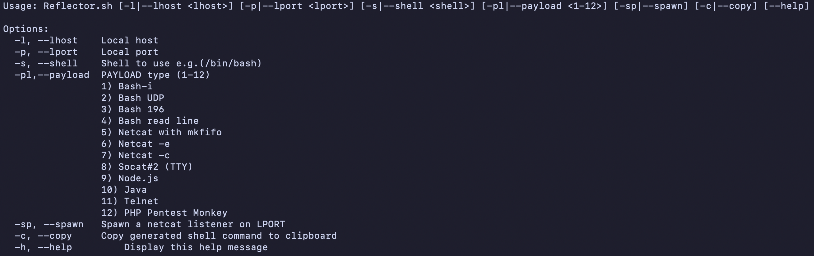

# Reflector
A quick reverse shell generator made with "Shell Script"



### Disclaimer:
This tool is only for educational and academic purposes and should only be used with strict consent. Do not use it for illegal purposes! Developers assume no liability and are not responsible for any misuse or damage caused by this tool and software.

### Installation:
```bash
wget https://github.com/MrMidnight7331/Reflector/blob/main/Reflector.sh
chmod +x Reflector.sh
```
### Usage:
```bash
./Reflector.sh [-l|--lhost <lhost>] [-p|--lport <lport>] [-s|--shell <shell>] [-pl|--payload <1-12>] [-sp|--spawn] [-c|--copy] [--help]

Options:
  -l, --lhost    Local host
  -p, --lport    Local port
  -s, --shell    Shell to use e.g.(/bin/bash)
  -pl,--payload  PAYLOAD type (1-12)
                 1) Bash-i
                 2) Bash UDP
                 3) Bash 196
                 4) Bash read line
                 5) Netcat with mkfifo
                 6) Netcat -e
                 7) Netcat -c
                 8) Socat#2 (TTY)
                 9) Node.js
                 10) Java
                 11) Telnet
                 12) PHP Pentest Monkey
  -sp, --spawn   Spawn a netcat listener on LPORT
  -c, --copy     Copy generated shell command to clipboard
  -h, --help         Display this help message
```
### Additional Information

If using the copy command please install [xclip](https://github.com/astrand/xclip)
```bash
sudo apt install xclip
```

---
### Socials

Email: mr.midnight.7331@gmail.com

Twitter: @MrMidnight53